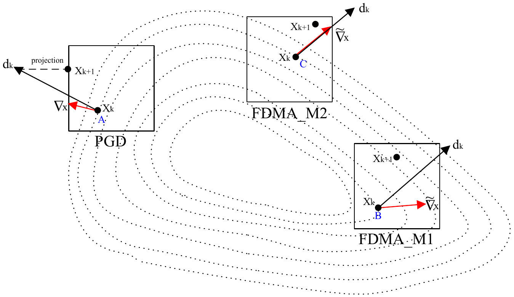
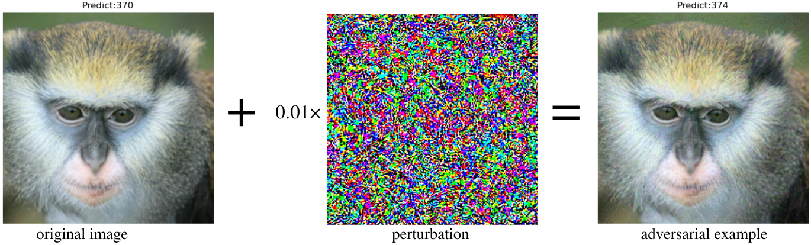
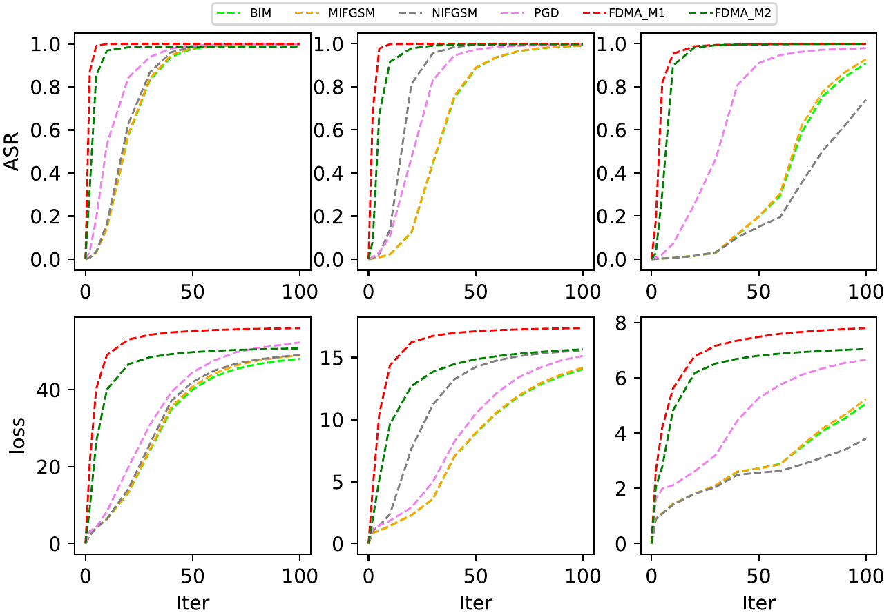

## Feasible_Direction_Method_Attack
#### Requirements
- pytorch
- torchvision
- numpy
- matplotlib
- torchattacks https://github.com/Harry24k/adversarial-attacks-pytorch
- robustbench https://github.com/RobustBench/robustbench

We propose a novel white-box attack based on feasible direction method. 
The following figure illustrates the search direction and step size of the attack:
<p align="center">
    
</p>


An adversarial example generated by the proposed method:
<p align="center">
    
</p>
<p align="center">
<b>Figure.</b>An adversarial example generated on ImageNet.
</p>

The following curves of attack success rate and loss on MNIST demonstrate the fast convergence rate of our method
<p align="center">
    
</p>
<p align="center">
<b>Figure.</b>Attack success rate and loss value of attacking on three MNIST models.
</p>

Our experiment is based on Python3.11. Only models for MNIST are in the repository. Models for CIFAR and ImageNet will be downloaded automatically by robustbench package. MNIST and CIFAR datasets would also be downloaded automatically and the images used for ImageNet(ILSVRC2012) are the first 1000 in validation set. To reproduce the results presented:

- Results for MNIST in Table 2 to Table 4 can be generated by running  ```python experiment_MNIST_FDMA.py```.<br>
- Results for CIFAR10 in Table 5 to Table 7 can be generated by running  ```python experiment_Cifar10_FDMA.py```.<br>
- Results for ImageNet in Table 8 to Table 10 can be generated by running  ```python experiment_ImageNet_FDMA.py```.<br>
- Running results will be stored in ```./result```


